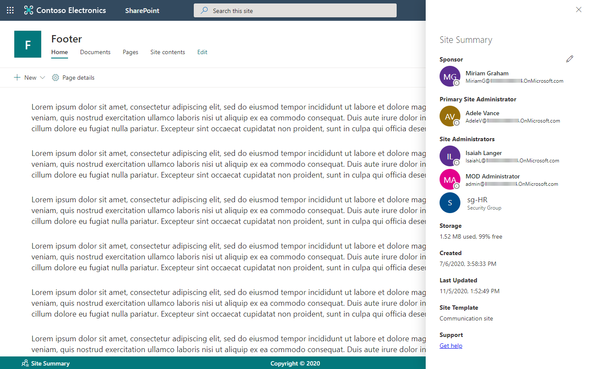

# SharePoint Modern Footer
## Summary
A custom footer for modern SharePoint sites developed using a SharePoint Framework application customizer extension. The footer includes a copyright message, a link for users to contact support, and a button to access basic details about the site. The site summary panel displays site/group owners, storage usage, created date, last updated date, site template, and Office 365 Group ID (groups only). Optionally, you can name a `Sponsor` and `Primary Site Administrator` (see [Site Configuration](#site-configuration)).

### Used SharePoint Framework Version

## Setup Instructions
### Pre-requisites
- App Catalog: Ensure the [App Catalog](https://docs.microsoft.com/en-us/sharepoint/use-app-catalog) is setup in your SharePoint Online tenant.

### Installation
1. Download the latest SPFx package file from [releases](https://github.com/bschlintz/spfx-footer/releases/latest) or clone the repo and build the package yourself.
1. Upload sppkg file to the 'Apps for SharePoint' library in your Tenant App Catalog.
1. Click the 'Make this solution available to all sites in your organization' checkbox and then click Deploy
1. On the App Catalog site, navigate to the Site Contents page and then click on Tenant Wide Extensions
1.	You should see an item added to the Tenant Wide Extensions list; you may update the settings if needed.

> __Note__: You may have to wait a few hours for the Tenant Wide Extension to propagate the very first time you use this feature. Subsequent Tenant Wide Extension items or updates to existing items will take effect much quicker.

### Updates
Follow the same steps as installation. Overwrite the existing package in the 'Apps for SharePoint' library when uploading the new package. 

> __Tip #1__: Be sure to check-in the sppkg file after the deployment if it is left checked-out.

> __Tip #2__: Ensure there aren't duplicate entries in the Tenant Wide Extensions list after deploying an update. Delete any duplicates if there are any.

## Global Configuration
This solution is deployed using [Tenant Wide Extensions](https://docs.microsoft.com/en-us/sharepoint/dev/spfx/extensions/basics/tenant-wide-deployment-extensions). You can modify the configuration of the Footer via JSON properties via the item added to the Tenant Wide Extensions list. The available properties are below.

| Property Name       | Default Value | Description |
| ------------------- | ------------- | ----- |
| SiteSponsorEditorsAADGroupId | `"00000000-0000-0000-0000-000000000000"` | Optional. Specify an Azure AD security group ID to limit who can modify the `Site Sponsor` field. |
| DisableSiteSponsor | `false` | Optional. Disable the `Site Sponsor` functionality and hide the field within the panel. |
| CopyrightText | `"Copyright © {current_year}"` | Optional. Copyright text displayed in the center of the banner. May use `{current_year}` text token to have the current year inserted into copyright message. |
| SupportLink | `""` | Optional. Specify a hyperlink that users will be taken to if they click the "Get Help" link within the summary panel. |
| FooterBackgroundColor | `""` | Optional. Override the background color of the footer by specifying any valid CSS color (e.g. `"red"`, `"#09c"`, `"rgba(1,1,1,0.3)"`). If not specified, theme colors will be used. |
| FooterForegroundColor | `""` | Optional. Override the foreground/text color of the footer by specifying any valid CSS color (e.g. `"red"`, `"#09c"`, `"rgba(1,1,1,0.3)"`). If not specified, theme colors will be used. |

## Site Configuration
You may use the included [ProvisionLists.ps1](./powershell/ProvisionLists.ps1) PowerShell script to create a hidden list named `SiteConfig` on site(s) where the banner is installed to enable additional functionality. You can view this list by navigating directly to the URL `<<Site URL>>/lists/SiteConfig` (not visible from Site Contents page).

The key/value configuration list will be created with two list items by default: `SITE_SPONSOR` and `SITE_PRIMARY_ADMIN`. These items support a value of any valid User Principal Name (e.g. `i:0#.f|membership|user@tenant.onmicrosoft.com`) and will be displayed in the site summary panel accessible from the footer.

The `Site Sponsor` field is editable by anyone who is a member of the Azure AD security group identified by the `SiteSponsorEditorsAADGroupId` extension property. Members of this security group will see an edit button next to the `Site Sponsor` in the summary panel allowing them to modify the value. This updated value will be reflected in the `SiteConfig` list.

## Version history

Version|Date|Comments
-------|----|--------
1.3.1|November 5, 2020|Added support for `FooterBackgroundColor` and `FooterForegroundColor` extension properties to override theme colors.

## Disclaimer
Microsoft provides programming examples for illustration only, without warranty either expressed or implied, including, but not limited to, the implied warranties of merchantability and/or fitness for a particular purpose. We grant You a nonexclusive, royalty-free right to use and modify the Sample Code and to reproduce and distribute the object code form of the Sample Code, provided that You agree: (i) to not use Our name, logo, or trademarks to market Your software product in which the Sample Code is embedded; (ii) to include a valid copyright notice on Your software product in which the Sample Code is embedded; and (iii) to indemnify, hold harmless, and defend Us and Our suppliers from and against any claims or lawsuits, including attorneys' fees, that arise or result from the use or distribution of the Sample Code.

## References
- [Getting started with SharePoint Framework](https://docs.microsoft.com/en-us/sharepoint/dev/spfx/set-up-your-developer-tenant)
- [Building for Microsoft teams](https://docs.microsoft.com/en-us/sharepoint/dev/spfx/build-for-teams-overview)
- [Use Microsoft Graph in your solution](https://docs.microsoft.com/en-us/sharepoint/dev/spfx/web-parts/get-started/using-microsoft-graph-apis)
- [Publish SharePoint Framework applications to the Marketplace](https://docs.microsoft.com/en-us/sharepoint/dev/spfx/publish-to-marketplace-overview)
- [Microsoft 365 Patterns and Practices](https://aka.ms/m365pnp) - Guidance, tooling, samples and open-source controls for your Microsoft 365 development
